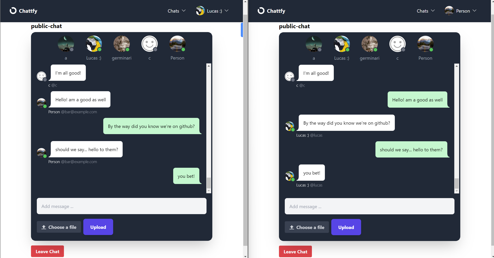

# Chattfy
Chattfy is a real-time chat web application developed with Django. It uses web sockets to allow real-time smooth communications between two or more users via a persistent web connection. Moreover, HTMX is used and  contributes to a smooth experience by 
allowing partial page updates in real-time. Here's what the main page of the app looks like (which displays an example of chat rooms with multiple users, even though private messaging is also supported):




## Quick Start and Requirements

You can follow these steps to start the application:
1. Clone the repository
  ```txt
  git clone https://github.com/Germinari1/Chattfy.git
  ```

2. If you want to (even though this is optional), you can set up a virtual environment:
```txt
python -m venv venv
source venv/bin/activate  # On Windows use `venv\Scripts\activate`
```
3. Install dependencies.
Chattfy has the following requirements:
```txt
Django
pillow
django-cleanup
django-allauth
django-htmx
```
An easy way to install those is by running the following command in your terminal:
```txt
pip install -r requirements.txt
```
4. Set up the database:
```txt
python manage.py migrate
```
5. Create a superuser:
```txt
python manage.py createsuperuser
```
6. Run the development server:
```txt
python manage.py runserver
```
7. Access the application. Open your web browser and navigate to http://localhost:8000
8. Detail: after you create an account in the app, do the following (for the reason explained in the next section): go to the Django admin page >  select the table "email addresses" and manually verify your email address. Now you`re good to go!

## Features and details
It is worth noting that by downloading the repository as it is, you will only be able to run it in development mode. If you look at settings.py, you'll notice that some lines of code (most commented out) actually have the structure of a production environment configuration (such as setting up a database and connecting to external services), so one could actually deploy the application by creating a `.env` file with the correct URLs (for instance, a URL provided by Railway if you decided to deploy the application with Redis), uncommenting the lines which take care of the related settings, and adding any extras you'd like. <be><br>
Now, it's time to learn about some features that Chattfy offers:
- Real-time chat with a group of users
- Real-time chat with a specific user (private messaging)
- Text messages and file uploads (PDFs, images, GIFs, etc) are supported
- A chatroom admin can change the room`s name, kick out members, and delete the room
- It is possible to customize your profile's description, picture, and display name
- Web sockets and HTMX allow for a smooth experience, in which there are no frequent page reloads

## Contributing
Ideas for enhancement and new features are welcome, so feel free to initiate pull requests.
